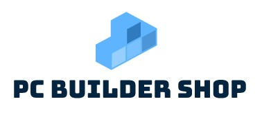

[![Contributors][contributors-shield]][contributors-url]
[![Forks][forks-shield]][forks-url]
[![Stargazers][stars-shield]][stars-url]
[![Issues][issues-shield]][issues-url]
[![MIT License][license-shield]][license-url]
[![LinkedIn][linkedin-shield]][linkedin-url]


<!-- PROJECT LOGO -->
<br />
<p align="center">
  <a href="https://github.com/github_username/repo_name">
    
  </a>

<h3 align="center">Pc Builder Shop</h3>

  <p align="center">
    Website for buy components and build your PC.
    <br />
    <br />
    <a href="">View Demo (Not set up at the moment)</a>
    ·
    <a href="https://github.com/szczygiel2000/PCBuilderShopApplication---Backend/issues">Report Bug</a>
    ·
    <a href="https://github.com/szczygiel2000/PCBuilderShopApplication---Backend/issues">Request Feature</a>
  </p>


<!-- TABLE OF CONTENTS -->
<details open="open">
  <summary><h2 style="display: inline-block">Table of Contents</h2></summary>
  <ol>
    <li>
      <a href="#about-the-project">About The Project</a>
      <ul>
        <li><a href="#built-with">Built With</a></li>
      </ul>
    </li>
    <li>
      <a href="#getting-started">Getting Started</a>
    </li>
    <li><a href="#features">Features</a></li>
    <li><a href="#contributing">Contributing</a></li>
    <li><a href="#license">License</a></li>
    <li><a href="#contact">Contact</a></li>
  </ol>
</details>


<!-- ABOUT THE PROJECT -->

## About The Project

#### Note that this project is in early development and mainly for learning purpose!

This is backend part of Pc Builder Shop Application.

Pc Builder Shop Application help users to improve their PC's by selling parts and buying a new one.

If you want to see frontend code go [here](https://github.com/szczygiel2000/PCBuilderShopApplication---Frontend).

### Built With

* [Java](https://java.com/)
* [Spring Boot](https://spring.io/)
* [MongoDB](https://www.mysql.com/)
* [Junit 5](https://junit.org/junit5/)

<!-- GETTING STARTED -->

## Getting Started

To quickly run local Exbook server follow instructions bellow

### MySQL setup

Check the MySQL site to learn how to create your own local
server. [documentation](https://dev.mysql.com/doc/mysql-getting-started/en/)
Then in resources add application.yaml file with a setup for your own database. It should look like this

```yaml
spring:
  datasource:
    url: ULR_TO_YOUR_DB
    username: root
    password: password
    driverClassName: com.mysql.cj.jdbc.Driver
  jpa:
    hibernate:
      ddl-auto: update
```

### App secrets in file

Application to work needs various secrets like jwt token secret key. In root folder of project update application.yaml
file, and paste bellow code with your own values to this file like this.

```yaml
application:
  jwt:
    secretKey: 'my_own_very_secret_and_very_very_long_key_for_providing_very_very_secure_jwt_tokens'
    tokenPrefix: 'Bearer '
    tokenExpirationAfterHours: 48
```

### Application

To download the latest .jar stable version of server go
to [releases](https://github.com/szczygiel2000/PCBuilderShopApplication---Backend/releases) page. Otherwise, if you
want, you can download code from any branch (be carefully, there is no guaranty that this code will run or compile
without problems). Just simply clone repo to your IDE and run it.

## Features

### Implemented

* Categories crud
* User accounts crud
* Items crud
* JWT Token Authorization
* Swagger
* Searching items
* Displaying items

### Not fully implemented

* Unit/e2e tests

### Not implemented yet

* Buying items
* Email confirmation

See the [open issues](https://github.com/szczygiel2000/PCBuilderShopApplication---Backend/issues) for a list of proposed
features (and known issues).


<!-- CONTRIBUTING -->

## Contributing

Contributions are what make the open source community such an amazing place to be learn, inspire, and create. Any
contributions you make are **greatly appreciated**.

1. Fork the Project
2. Create your Feature Branch (`git checkout -b feature/AmazingFeature`)
3. Commit your Changes (`git commit -m 'Add some AmazingFeature'`)
4. Push to the Branch (`git push origin feature/AmazingFeature`)
5. Open a Pull Request

<!-- LICENSE -->

## License

Distributed under the MIT License. See `LICENSE` for more information.

<!-- CONTACT -->

## Contact

Mateusz Szczygieł - [mszczygiel.contact@gmail.com](mailto:mszczygiel.contact@gmail.com) - Mail

<!-- MARKDOWN LINKS & IMAGES -->
<!-- https://www.markdownguide.org/basic-syntax/#reference-style-links -->

[contributors-shield]: https://img.shields.io/github/contributors/szczygiel2000/PCBuilderShopApplication---Backend.svg?style=for-the-badge

[contributors-url]: https://github.com/szczygiel2000/PCBuilderShopApplication---Backend/graphs/contributors

[forks-shield]: https://img.shields.io/github/forks/szczygiel2000/PCBuilderShopApplication---Backend.svg?style=for-the-badge

[forks-url]: https://github.com/szczygiel2000/PCBuilderShopApplication---Backend/network/members

[stars-shield]: https://img.shields.io/github/stars/szczygiel2000/PCBuilderShopApplication---Backend.svg?style=for-the-badge

[stars-url]: https://github.com/szczygiel2000/PCBuilderShopApplication---Backend/stargazers

[issues-shield]: https://img.shields.io/github/issues/szczygiel2000/PCBuilderShopApplication---Backend.svg?style=for-the-badge

[issues-url]: https://github.com/szczygiel2000/PCBuilderShopApplication---Backend/issues

[license-shield]: https://img.shields.io/github/license/szczygiel2000/PCBuilderShopApplication---Backend.svg?style=for-the-badge

[license-url]: https://github.com/szczygiel2000/PCBuilderShopApplication---Backend/blob/master/LICENSE.txt

[linkedin-shield]: https://img.shields.io/badge/-LinkedIn-black.svg?style=for-the-badge&logo=linkedin&colorB=555

[linkedin-url]: https://www.linkedin.com/in/mateusz-szczygieł-502727197/